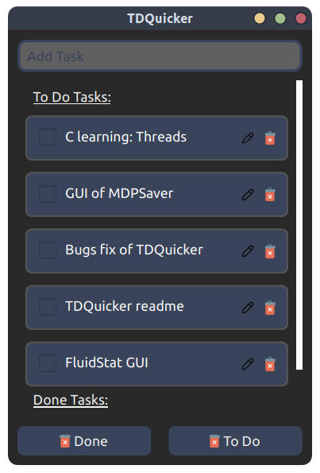
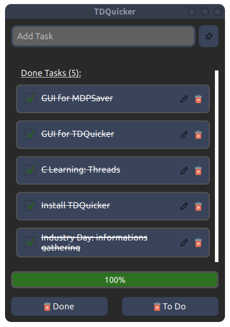
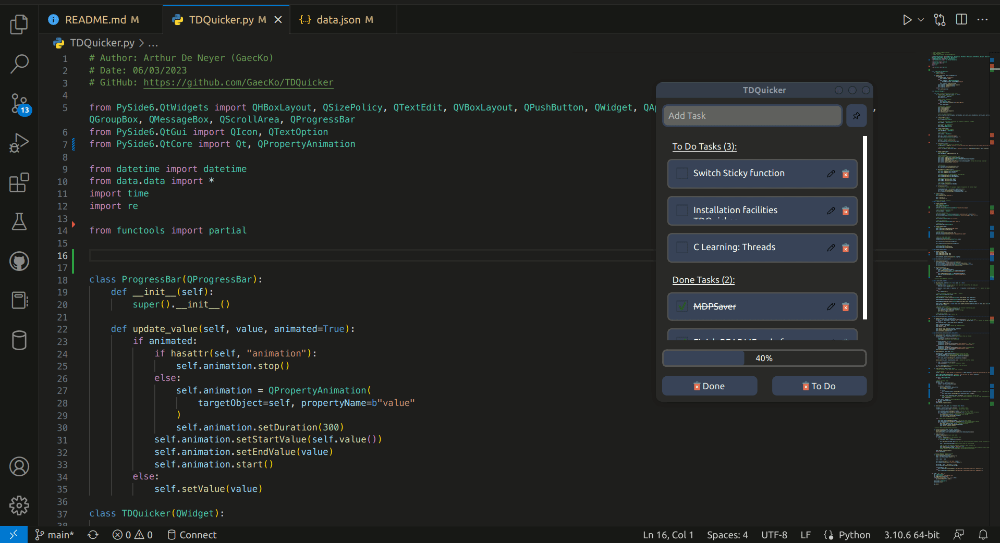
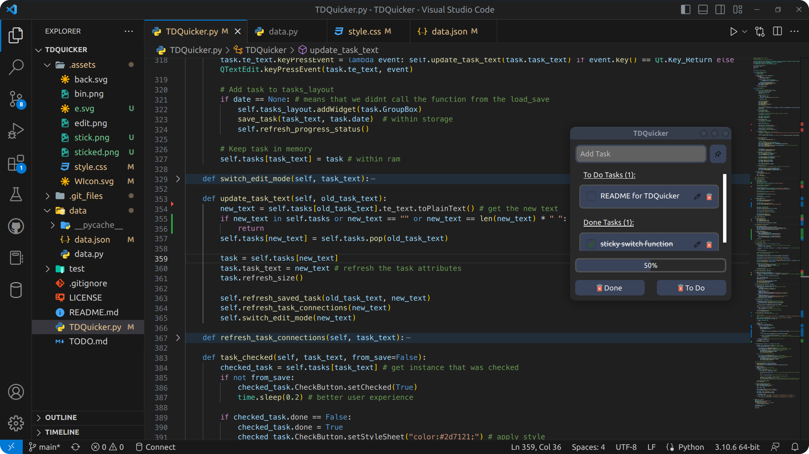

# <h1 align="center"><ins> TDQuicker</ins> v1.0.0 !</h1>

<p align="center">
	
	
	
	
	
</p>
<h1 align="center">

[](https://paypal.me/ArthurDeNeyer?country.x=BE&locale.x=fr_FR) 

</h1>

**TDQuicker** is a simple **To Do list** made with `PySide6`. 
<p float="left" align="center">
    
	
</p>

****
## <ins>Installation</ins>: 
### Installer for Windows users
In the last release, look up for the `TDQuickerInstaller.exe` file. After downloading it, launch it and follow the instructions shown in the installer. 

Once done, TDQuicker should be useable! 

****

### Using Python (For Mac & Linux)

You need [python3.x](https://www.python.org/downloads/) installed. 

> __Warning__: The `shiboken6` package (used by `PySide6`) seems to not work on all python version, so you need `python3.x ≥ python3.7`. 

You will also need to install this package:
* [X] **PySide6**: `pip install PySide6` 
> __Note__: it will install other required packages like `shiboken6`, ...

> __Note__: You can also use: `pip install -r requirements.txt` which will check other preinstalled packages as well. 

The app also uses these already installed packages:
* [X] **datetime** 
* [X] **time** 
* [X] **re** 

****

Once your python is set up, you can follow these instructions:
1. Clone the git: 
```git
git clone git@github.com:GaecKo/TDQuicker.git
```
2. Place yourself in the git directory
```bash
cd TDQuicker
```
3. You can then launch the `.py` file: 
```bash
python TDQuicker.py
``` 
> __Warning__: You may need to use `python3` as a command instead of `python`

****

### <ins> Usage </ins>:
<p align="center">  </p>

### Add Task
> To add a task, place your self in the text prompt, type a valid task (so not empty) and press enter to save! 

### Check Task
> To mark a task as done, you can click on the box and it will move the task to the done section 

### Edit Task
> To edit a task, click on pencil button, place yourself in the text, modify the content as you wish and press enter to save. You can also click on the same button again to cancel changes. 


### Delete Task
> To delete a task, simply click on the bin button
* You can also click on the bottom 
	* "Done" button to delete all done tasks
	* "To Do" button to delete all To Do tasks

### Sticky Window
> To make the window stick over other windows, you can click on the pin button (next to the text prompt). This allows the app to stay over other windows even if it looses focus. 
<p align="center"></p>

****

## <ins>Known Issues</ins>:

> __Note__: A few issues are currently known. 

1. Task alignment when the scroll bar is not shown: 
	* I have tried a lot of things to fix this, but without any result... 

2. Height of the task boxes:
	* The height of the boxes containing the task is not responsive. I couldn't figure how to make it have a good height without making the text scrollable. 

3. Sticky mode refresh the window:
	* That's not a huge problem but it's not looking fantastic... I don't even know if it is possible to avoid that. 

4. Scroll text appears unexpectedly on mac:
	* On mac, the `QTextEdit()` widget seems to enjoy making the zone scrollable and thus making it hard to read and focus, especially on small text.

* If you have any idea on how to fix these bugs or if you see any other: [Pull Requests](https://github.com/GaecKo/TDQuicker/pulls) and [Issues](https://github.com/GaecKo/TDQuicker/issues) are good places to let me know! 

