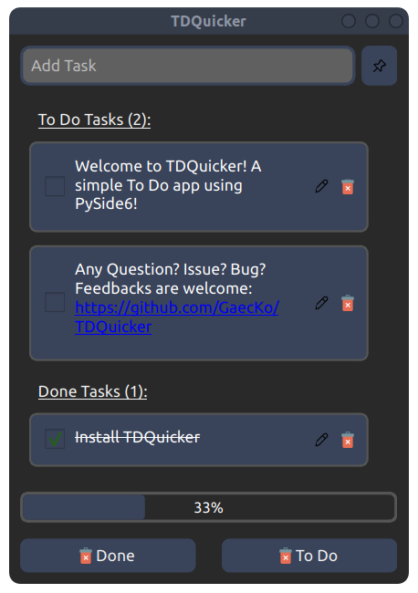

# <h1 align="center"><ins> TDQuicker</ins> v0.5.0 !</h1>

	
	
	
	
	

<h1 align="center">

 

</h1>

## TDQuicher
TDQuicker is a simple To Do list made with `PySide6`, `Qt`. 

    

****
### Installation: 
##### <ins> Using Python </ins> 
You need [python3.x](https://www.python.org/downloads/) installed
You will need to install these packages:
1. **PySide6**: `pip install PySide6`
2. **functools**: `pip install functools`

The app also requires these already installed packages:
1. **Datetime**
2. **time** 

****

### Usage:
1. Place yourself in the directory where you installed the app (for example `/home/usr/Documents/TDQuicker/`) 
2. You can then launch the `.py` file:`python TDQuicker.py`. This will start the GUI. 

### Notes:
More info will come soon. 